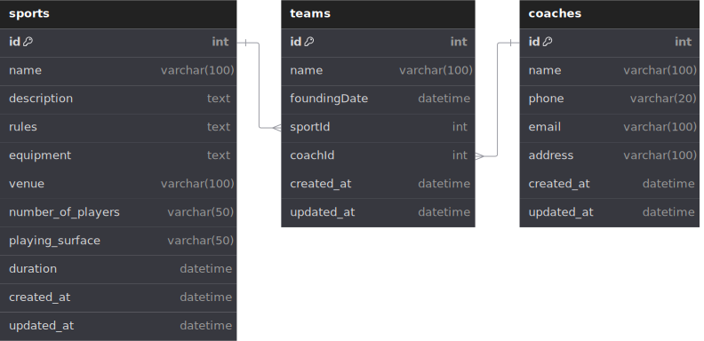

# SportStat-API: Backend REST API

This README file provides information about the SportStat-API project.

## REST API Endpoints

You can interact with the SportStat-API through the following endpoints:

- **Production:** [https://sportstat-api.example.com](https://sportstat-api.example.com)
- **Local:** [http://localhost:3000](http://localhost:3000)

### Endpoint Descriptions

| Endpoint       | HTTP   | Description              |
| -------------- | ------ | ------------------------ |
| `/sports`      | GET    | Get all sports           |
| `/sports/:id`  | GET    | Get sport by id          |
| `/sports`      | POST   | Add new sport            |
| `/sports/seed` | POST   | Seed initial sports data |
| `/sports`      | DELETE | Delete all sports        |
| `/sports/:id`  | DELETE | Delete sport by id       |
| `/sports/:id`  | PUT    | Update sport by id       |

## Database Design Schema



## Getting Started

To install dependencies and run the project in development mode, follow these steps:

1. Install dependencies:

   ```sh
   npm install
   ```

2. Start the server in development mode:
   ```sh
   npm run dev
   ```

After running the project, you can access it at [http://localhost:3000](http://localhost:3000).
